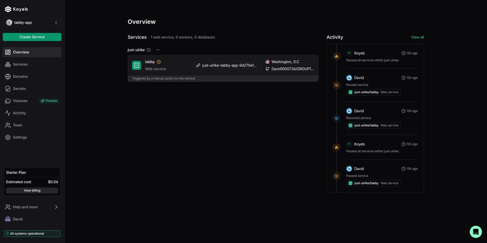
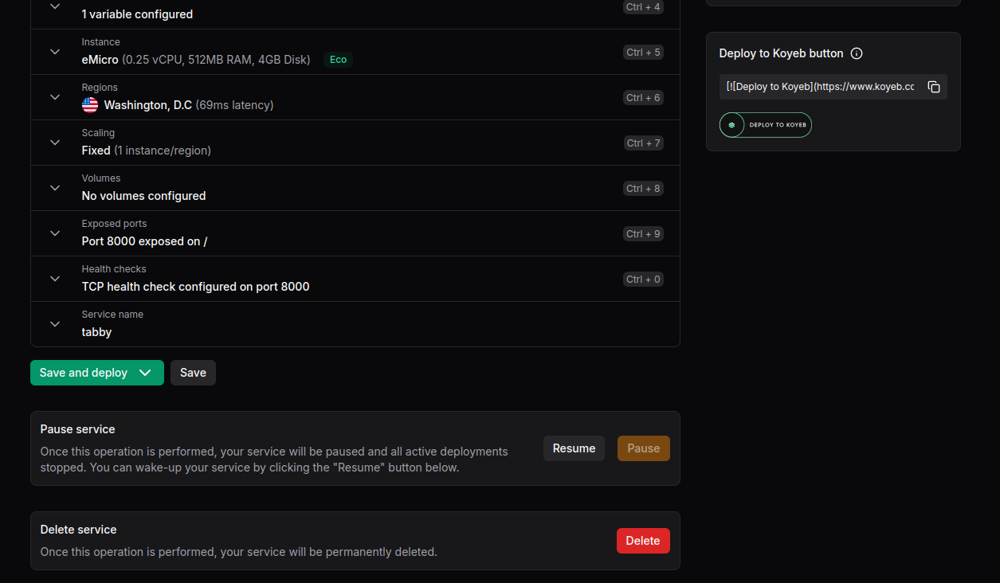
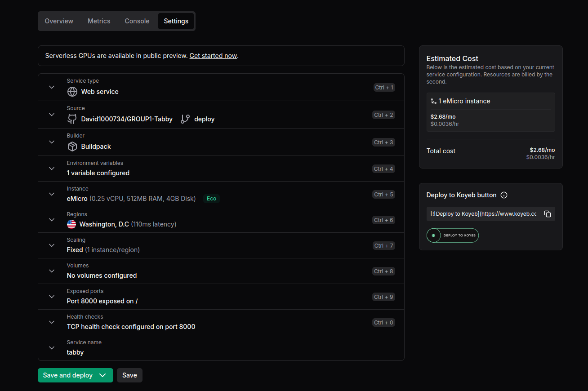
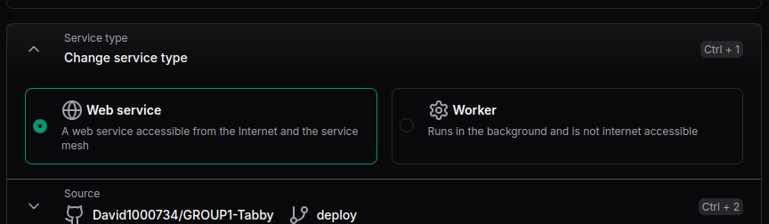
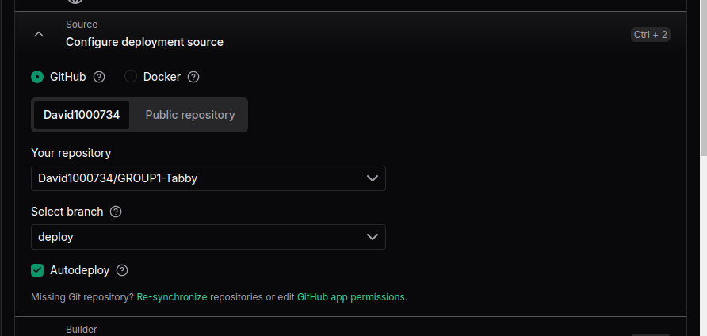
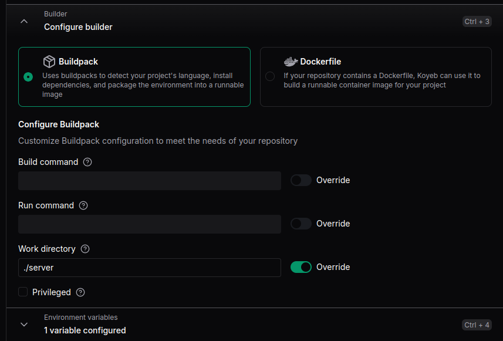
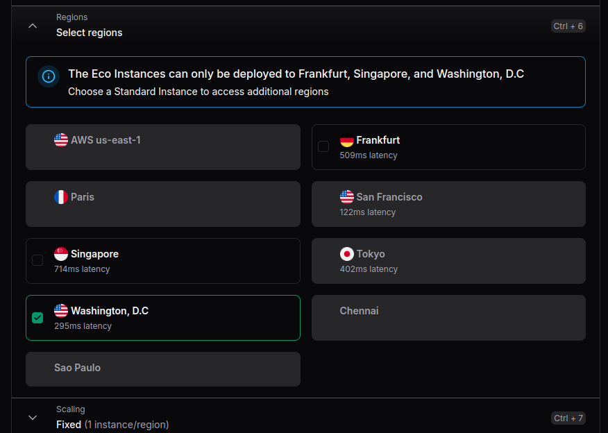
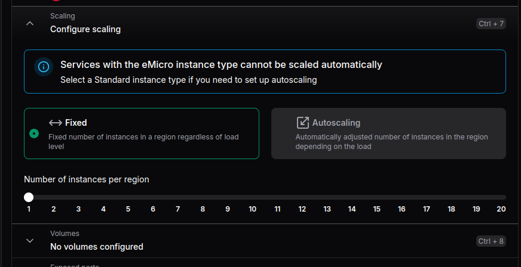

# Setup the server
This guide will assume you have already have python and pip installed
on your computer! 😢

For some users, it may be possible to simply use 
`python3 -m tabby_server`
to start the server if dependences are already installed.
Otherwise...

### Install Poetry
We use Poetry as the package manager for this project. You can install it
[here](https://python-poetry.org/docs/#installation). I recommend installing
it using the **official installer**.

### Check that you have the right version
Make sure you have the right version of Python installed. We use
Python 3.12.

Mac/Linux
* `python3 --version`

Windows
* `python --version`

### Go into the server folder

Go into the server folder using `cd`.

```
cd server
```

### Ensure that you have a Virtual Environment.

Make sure you are in `server/`, NOT `server/tabby_server`.

Mac/Linux

```
python3 -m venv venv
```

Windows
```
python -m venv venv
```

This will create a folder called `venv/` which contain all of the dependencies
you can install locally.

### Activate the Virtual Environment

Mac/Linux
* `source venv/bin/activate`

Windows
* `./venv/Scripts/activate`

*** You will likely encounter stating windows cannot run scripts. 
You can remove it by doing this

`Set-ExecutionPolicy -ExecutionPolicy RemoteSigned`

Explanation: By default Windows disallows any scrips being ran (Restricted).
By using the command you are allowing only signed scripts from remote
and unsigned in local to run.

### Run the server

In the `server/` folder, do:

```
poetry install
```

This will install all of the dependencies, by reading `server/pyproject.toml`.

Now everything is setup, run it.

```
python -m tabby_server
```

## Disclaimer
Per Python's best practices, it is no longer encouraged to pip install
into your home computer. Instead, you must/should install all pip
packaged onto a virtual environment like venv. It is possible to
ignore this warning but we will be using venv for the server.

### TLDR, here is the video I followed...
This video goes through the entire process to setup the server as well
as the react app.

[Video](https://www.youtube.com/watch?v=7LNl2JlZKHA)


### Poe Scripts

Below are the scripts for Poe:

```bash
poe ci  # Runs the CI pipeline (lint, type, test)
poe dev  # Runs the development server.
poe format  # Formats all files in `tabby_server/` and `tests/`
poe lint  # Runs flake8 linter
poe test  # Runs unit tests and produces a coverage report.
poe type  # Runs type checks using mypy
```

**Before committing/making a pull request, make sure you use `poe ci`!**

This will run the linter checks, type checker, and unit tests on your local
machine. This saves time from having Github Actions do the work through the
workflow.

# Koyeb Deployment
Koyeb is a web hosting service offering CPU and GPU instances. The current project will be using a GPU instance needed because the server will have to perform some intense processing for image and character recognition.



## Starting/Pausing the instance
### Starting
Starting an instance can be as simply as clicking the resume button after navigating to the app itself.


Evidently, there has been a push in the repository and Koyeb is informing you to redeploy the instance. Doing this will also start the instance after a successful build and health check.

### Stopping
To stop the instance, navigate to the settings tab and scroll all the way to the bottom. There you will notice a button to pause or delete the app.



❗IMPORTANT❗: Stop the instance when not in use because Koyeb charges every second including the build time and the cost adds up.

## Instance settings
There are a lot of settings that can be changed for the instance with many of them we do not need to worry about so I will describe only the relevant ones.



### Service type
What type of instance do we need? Should it have access to the internet or not.



### Source
Where should Koyeb go to find the source code? An option of using github repos or a Docker image file is avalible. Currently, it is using a forked version of the source code which is a "private" directory. We will have to change this to be the correct public repository later. Auto deploy should be avalible for both public and private repsitorys.



### Build
This section specifies how Koyeb should build the project. 
* __Build Command__: Will be the first command ran which should build all the dependencies for the project. 
>__By default__, this build will run `pip -r requirements.txt`, override this to run any other bash commands. NOTE: Overriding and attempting to run `pip ...` would not work because pip is not a recognized command for some reason. 

* __Run Command__: Will be the second command ran and will attempt to run the actual project.
>__By default__, this will run whatever was provided in the 'Procfile' for the "web:" parameter. Override this to run any other bash command. 

* __Work Directory__: Specifys the location of source directory. Changing this will affect where the build and run command is ran.
>__By default__, the working directory is simply wherever the git repository is at. Override this to moving into any other nested directory. 



### Instances
A few instances are offered with a majority of them being CPU instances. Notable, the free instance only allows for 2000MB of disk storage which apparently exceeds the size of the build for the project. Requiring an upgrade to another CPU instance so that it can be build properly. 


### Regions
Depending on the selected instance, different regions will become avalible. For this particular example, the region which would result in the least latency is Washington D.C so that will be the region we will be using for now. 



### Scaling
Depending on the selected instance, different options will become avalible for scaling; wheither it be fixed or autoscaled. Scaling will help with load balancing and prevent long wait times for the server to respond. 
Currently, just one instance is sufficient for most tasks. 



❗❗❗Once again, it is important to stop the instance if it is not in use to prevent acruding uneccessary cost. 