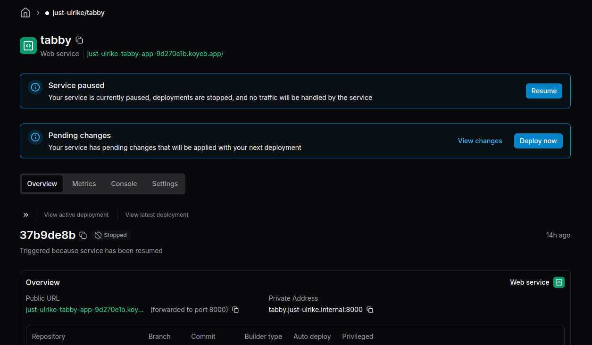
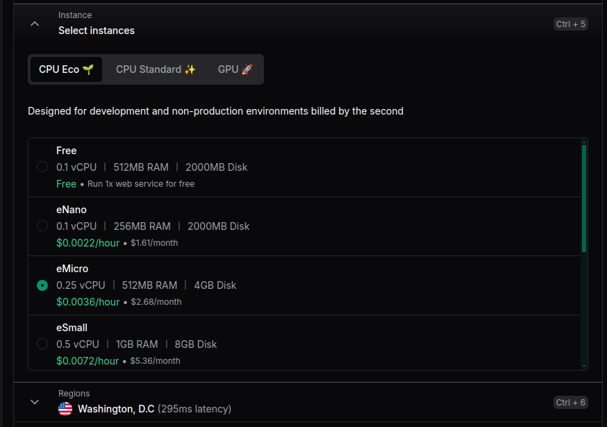

# Setup the server
This guide will assume you have already have python and pip installed
on your computer! 😢

For some users, it may be possible to simply use 
`python3 -m tabby_server`
to start the server if dependences are already installed.
Otherwise...

### Install Poetry
We use Poetry as the package manager for this project. You can install it
[here](https://python-poetry.org/docs/#installation). I recommend installing
it using the **official installer**.

### Check that you have the right version
Make sure you have the right version of Python installed. We use
Python 3.12.

Mac/Linux
* `python3 --version`

Windows
* `python --version`

### Go into the server folder

Go into the server folder using `cd`.

```
cd server
```

### Ensure that you have a Virtual Environment.

Make sure you are in `server/`, NOT `server/tabby_server`.

Mac/Linux

```
python3 -m venv venv
```

Windows
```
python -m venv venv
```

This will create a folder called `venv/` which contain all of the dependencies
you can install locally.

### Activate the Virtual Environment

Mac/Linux
* `source venv/bin/activate`

Windows
* `./venv/Scripts/activate`

*** You will likely encounter stating windows cannot run scripts. 
You can remove it by doing this

`Set-ExecutionPolicy -ExecutionPolicy RemoteSigned`

Explanation: By default Windows disallows any scrips being ran (Restricted).
By using the command you are allowing only signed scripts from remote
and unsigned in local to run.

### Run the server

In the `server/` folder, do:

```
poetry install
```

This will install all of the dependencies, by reading `server/pyproject.toml`.

Now everything is setup, run it.

```
python -m tabby_server
```

## Disclaimer
Per Python's best practices, it is no longer encouraged to pip install
into your home computer. Instead, you must/should install all pip
packaged onto a virtual environment like venv. It is possible to
ignore this warning but we will be using venv for the server.

### TLDR, here is the video I followed...
This video goes through the entire process to setup the server as well
as the react app.

[Video](https://www.youtube.com/watch?v=7LNl2JlZKHA)


### Poe Scripts

Below are the scripts for Poe:

```bash
poe ci  # Runs the CI pipeline (lint, type, test)
poe dev  # Runs the development server.
poe format  # Formats all files in `tabby_server/` and `tests/`
poe lint  # Runs flake8 linter
poe test  # Runs unit tests and produces a coverage report.
poe type  # Runs type checks using mypy
```

**Before committing/making a pull request, make sure you use `poe ci`!**

This will run the linter checks, type checker, and unit tests on your local
machine. This saves time from having Github Actions do the work through the
workflow.

# Server API Reference

Here is a reference of the server's API. All endpoints return a response of the
same format.

## Response Format

A success response from the server will result in a `200: OK` status, while
bad requests result in a `400: BAD REQUEST` status.

The body of both `200` and `400` responses are in JSON.

A successful (`200`) response is in the following format:

```
{
  message: string
  results: [
    {
      // All string properties are replaced with "" if not given
      authors: string         // separated by commas
      excerpt: string
      isbn: string            // guaranteed to be provided, ISBN 13
      page_count: number      // -1 if not given
      published_date: string  // YYYY-MM-DD
      publisher: string
      rating: number          // -1.0 if not given
      summary: string
      thumbnail: string
      title: string
    }
  ]
  resultsCount: string
}
```

Here is an example result adapted from a real example:

```json
{
    "message": "Found 2 books.",
    "results": [
        {
            "authors": "Harper Lee",
            "excerpt": "The explosion of racial hate and violence in a...",
            "genres": "Fiction",
            "isbn": "9780060194994",
            "page_count": 350,  // -1 if not given
            "published_date": "1999-11-03",
            "publisher": "HarperCollins Christian Publishing",
            "rating": 4,  // -1 if not given
            "summary": "The explosion of racial hate and violence in a small Alabama town is viewed by a little girl whose father defends a Black man accused of rape",
            "thumbnail": "http://books.google.com/books/content?id=ayJpGQeyxgkC&printsec=frontcover&img=1&zoom=1&edge=curl&source=gbs_api",
            "title": "To Kill a Mockingbird 40th"
        },
        {
            "authors": "Michael J. Meyer",
            "excerpt": "In 1960, To Kill a Mockingbird was published t...",
            "genres": "Literary Criticism",
            "isbn": "9780810877238",
            "page_count": 292,
            "published_date": "2010-10-14",
            "publisher": "Scarecrow Press",
            "rating": 3.5,
            "summary": "In 1960, To Kill a Mockingbird was published to critical acclaim. To commemorate To Kill a Mockingbird's 50th anniversary, Michael J. Meyer has assembled a collection of new essays that celebrate this enduring work of American literature. These essays approach the novel from educational, legal, social, and thematic perspectives. Harper Lee's only novel won the Pulitzer Prize and was transformed into a beloved film starring Gregory Peck as Atticus Finch. An American classic that frequently appears in middle school and high school curriculums, the novel has been subjected to criticism for its subject matter and language. Still relevant and meaningful, To Kill a Mockingbird has nonetheless been under-appreciated by many critics. There are few books that address Lee's novel's contribution to the American canon and still fewer that offer insights that can be used by teachers and by students. These essays suggest that author Harper Lee deserves more credit for skillfully shaping a masterpiece that not only addresses the problems of the 1930s but also helps its readers see the problems and prejudices the world faces today. Intended for high school and undergraduate usage, as well as for teachers planning to use To Kill a Mockingbird in their classrooms, this collection will be a valuable resource for all teachers of American literature.",
            "thumbnail": "http://books.google.com/books/content?id=RyJtJZPX8jwC&printsec=frontcover&img=1&zoom=1&edge=curl&source=gbs_api",
            "title": "Harper Lee's To Kill a Mockingbird"
        }
  ],
  "resultsCount": 2
}
```

A failed response (`400`) is in the following format:

```
{
    message: string  // message attached to failure
}
```

Responses where no results were found are not considered to be failed.

## POST /books/scan_cover

Scans the given image of a single book and returns the possible books it could
be.

Expects a request with a body that is in *binary*, which represents an image.
The image can either be JPG or PNG.

## POST /books/scan_shelf

Scans the given image of a bookshelf and returns the books it thinks are in
the image.

Expects a request with a body that is in *binary*, which represents an image.
The image can either be JPG or PNG.

## GET /books/search

Searches for a particular book under a set of criteria.

Expects a request with *at least one* of the following parameters:

- `phrase`:    Phrase to search with. Think of this as the Search Bar in Google.
- `title`:     Title to search for.
- `author`:    Author to search for.
- `publisher`: Publisher to search for.
- `subject`:   Subject to search for.
- `isbn`:      ISBN to search for.

## GET /books/recommendations

Gets recommendations given a set of books.

Expects a request with the following parameters:

- `titles`: A list of titles, separated by `|---|`.
- `authors`: A list, with each element being an author or multiple authors
             separated by commas; each element is separated by `|---|`
- `weights`: A list of numbers corresponding to how heavily weighed is each
             book, separated by `|---|`. Each number is from 0 to 1.

All lists are parallel arrays, so the first title corresponds with the
first author(s) and first weight, the second title corresponds with the second
author(s) and second weight, and so on.

None of the elements can be blank.

# Koyeb Deployment
Koyeb is a web hosting service offering CPU and GPU instances. The current project will be using a GPU instance needed because the server will have to perform some intense processing for image and character recognition.


## Starting/Pausing the instance
### Starting
Starting an instance can be as simply as clicking the resume button after navigating to the app itself.



Evidently, there has been a push in the repository and Koyeb is informing you to redeploy the instance. Doing this will also start the instance after a successful build and health check.

### Stopping
To stop the instance, navigate to the settings tab and scroll all the way to the bottom. There you will notice a button to pause or delete the app.


❗IMPORTANT❗: Stop the instance when not in use because Koyeb charges every second including the build time and the cost adds up.

## Instance settings
There are a lot of settings that can be changed for the instance with many of them we do not need to worry about so I will describe only the relevant ones.


### Service type
What type of instance do we need? Should it have access to the internet or not.


### Source
Where should Koyeb go to find the source code? An option of using github repos or a Docker image file is avalible. Currently, it is using a forked version of the source code which is a "private" directory. We will have to change this to be the correct public repository later. Auto deploy should be avalible for both public and private repsitorys.


### Build
This section specifies how Koyeb should build the project. 
* __Build Command__: Will be the first command ran which should build all the dependencies for the project. 
>__By default__, this build will run `pip -r requirements.txt`, override this to run any other bash commands. NOTE: Overriding and attempting to run `pip ...` would not work because pip is not a recognized command for some reason. 

* __Run Command__: Will be the second command ran and will attempt to run the actual project.
>__By default__, this will run whatever was provided in the 'Procfile' for the "web:" parameter. Override this to run any other bash command. 

* __Work Directory__: Specifys the location of source directory. Changing this will affect where the build and run command is ran.
>__By default__, the working directory is simply wherever the git repository is at. Override this to moving into any other nested directory. 


### Environmental Variables
If the project needs environmental variables, it would have to be set here. Evidently, our project does require some environmental variables in the form of API keys and each of them will have to be listed here.


### Instances
A few instances are offered with a majority of them being CPU instances. Notable, the free instance only allows for 2000MB of disk storage which apparently exceeds the size of the build for the project. Requiring an upgrade to another CPU instance so that it can be build properly. 



### Regions
Depending on the selected instance, different regions will become avalible. For this particular example, the region which would result in the least latency is Washington D.C so that will be the region we will be using for now. 


### Scaling
Depending on the selected instance, different options will become avalible for scaling; wheither it be fixed or autoscaled. Scaling will help with load balancing and prevent long wait times for the server to respond. 
Currently, just one instance is sufficient for most tasks. 


❗❗❗Once again, it is important to stop the instance if it is not in use to prevent acruding uneccessary cost. 
